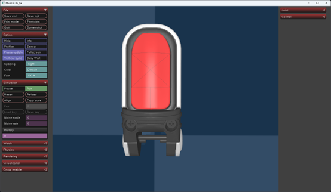
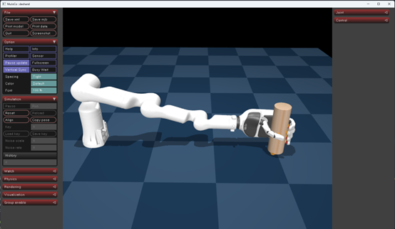

# 他山科技触觉模拟仿真平台使用手册

[中文](README_zh.md)

## 简介
欢迎使用他山科技触觉模拟仿真平台！本平台基于 MuJoCo 开发，旨在为研究人员和开发者提供一个高效、精准的机器人触觉模拟环境，助力机器人触觉感知技术的研究与创新。我们的模型是国内首个基于真实产品的触觉模拟仿真模型，对推动具身智能机器人的发展具有重要意义。

## 功能概述
- 通用触觉传感器模组 ：包括接近觉、触觉（法向力、切向力、切向力方向（切向力方向 1 ~ 360 度，指尖方向为 0））以及原始电容值（7 个原始电容值）的模拟。
- 带触觉的灵巧手 ：模拟具有触觉感知能力的灵巧手，可用于研究机器人手部的触觉交互与操作。

## 安装指南
1. 安装：在开始使用本平台之前，请确保您的系统满足以下要求并按照步骤进行安装。
- 环境要求
    - 操作系统：Windows 或 Linux
    - Python 版本：3.8 或以上


- python环境MuJoCo安装
    ```bash
    pip install mujoco==3.2.3
    ```

- 查看模型：
    - 查看通用触觉传感器模组的模型：
        ```bash
        python -m mujoco.viewer --mjcf=./mujoco_model/TS-F-A.xml
        ```

        这将启动 MuJoCo 观察器，您可以在其中查看通用触觉传感器模组的模型，观察其外观和内部结构。



    - 查看带触觉的灵巧手模型：
        ```bash
        python -m mujoco.viewer --mjcf=./mujoco_model/DexHand.xml
        ```

        这将启动 MuJoCo 观察器，显示带触觉的灵巧手模型，您可以观察及控制其各个关节运动和触觉传感器的布局。


2. 调用传感器回调函数 ：为了使模型能够准确地模拟触觉传感器的数据输出，您需要调用传感器回调函数。根据您的操作系统，分别使用以下文件：
    ```bash
    Windows ：mjcb_sensor\win\TSensor.pyd
    Linux ：mjcb_sensor\linux\TSensor.so
    ```

    请将相应的文件放置在您的项目目录中，并确保其路径正确。

3. 测试通用触觉模组：
    - 测试通用触觉模组：该测试脚本将模拟触觉传感器在不同接触情况下的数据输出，并验证模型的准确性和稳定性。
    ```bash
    python module_test.py
    ```

    - 测试灵巧手五指握抓：该测试脚本将模拟灵巧手进行物体的抓取和握持操作，展示其触觉感知能力在实际操作中的应用。
    ```bash
    python dexhand_grab.py
    ```


## 应用场景与示例
1. 机器人触觉感知研究：利用本平台，研究人员可以开展机器人触觉感知算法的研究，如触觉信号处理、特征提取、物体识别等。

2. 机器人操作任务模拟：通过模拟灵巧手的触觉感知和操作过程，开发和优化机器人操作任务的策略和算法，提高机器人在复杂任务中的表现。

3. 多模态感知融合：将触觉感知与视觉、听觉等其他感知模态进行融合，实现更全面、更准确的环境感知和物体理解。


## 常见问题解答
1. Q：安装过程中出现 MuJoCo 版本不兼容的错误，怎么办？<br>
A：请确保您安装的 MuJoCo 版本为 3.2.3，如之前已安装其他版本，请先卸载，再运行安装命令进行安装。

3. Q：运行模型时提示找不到模型文件，如何解决？<br>
A：请检查模型文件的路径是否正确，确保模型文件与脚本文件在同一目录下，或者在脚本中正确设置了模型文件的路径。

3. Q：在 Windows 系统下调用回调函数时，没有起作用，可能是哪里出了问题？<br>
A：在 Windows 系统下，确保 TSensor.pyd文件的路径正确，并且检查依赖的.dll文件是否损坏或不完整，如有需要，可重新下载文件进行替换。

## 贡献与反馈
我们欢迎全球范围内的生态伙伴共同参与本平台的训练与优化，贡献各自的技术力量和创意。如果您在使用过程中发现任何问题或有任何建议，欢迎通过以下方式与我们联系：
GitHub 仓库：在我们的[https://github.com/zh-run/DexTactiSim.git] 提交问题。
邮箱 ：您也可以通过发送邮件至[zhangrun@tashantec.com] 与我们联系。
